# Oracle Forms
## instalação

### Inicializando o Weblogic
Para que o forms se inicialize o webforms precisa estar rodando, com posse do usuário *weblogic* e da senha configurado na instalação você deve iniciar-lo, o luncher dele deve ser **Iniciar Weblogic Admin Server**. A não inicialização deve dar o erro **FRM-10142**.

### Definindo navegador
Uma vez feito todo o processo de instalação e estiver com o listener do **Oracle Forms** devidamente configurado e se conectando, você irá precisar informar o browser que deseja utilizar, para isso segue os menus abaixo:

    EDITAR > PREFERENCIAS

Uma vez chegado lá, na aba **Runtime** no campo, localização do webBrowser, você deve informar o path do navegador a ser usado, caso você não tenha configurado isso, deve dar o erro `FRM18125`.

### Plugin no navegador
Para que seja exibido o conteúdo do canvas do *Oracle Form* no seu navegador, se faz necessário instalar um plugin chamado **JInitiator**, procure por esse plugin na loja do seu navegador, e instale-o, pois é requisito obrigatório para que seja exibido alguma coisa no navegador. Ele é difícil de encontrar, você pode tentar instalar o **Oracle EBS R12&11i Enablement for Chrome**, ou pesquise por **Oracle EBS** em qualquer navegador que tem um plugin que funciona como trial.

### Permitindo a execução no Navegador
Procure por *configure Java*, uma vez aberto você vai para a guia segurança, na guia segurança existe um campo aonde tem a Lista de exceções de sites, ali você coloca a url ao qual o Oracle forms vai executar, você deve autorizar a **URL DO SERVIDOR DE APLICAÇÕES** ali.

#### Descobrindo a URL DO SERVIDOR DE APLICAÇÕES
Com o oracle forms aberto vai em:

    EDITAR > PREFERENCIAS

ma vez chegado lá, na aba **Runtime** no campo *URL DO SERVIDOR DE APLICAÇÕES* copia a *url* ali e [adicione na permissão na configuração do JAVA](#permitindo-a-execução-no-navegador).

## Explicando
### Básico
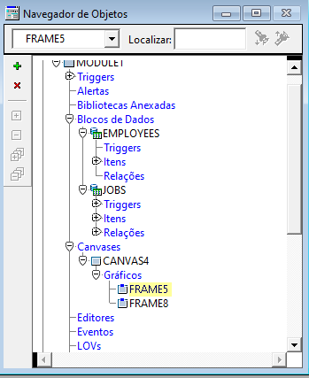
#### Bloco de dados
Essa parte se refere ou aos dados que devem ser processados, ou a(s) tabela(s) que tem ligação com o banco de dados, como no exemplo da imagem, seria a tabela **EMPLOYEES** ou **JOBS**. Dentro desse bloco tem o *triggers* que são *triggers* que podem ser anexados aos campos ou ao bloco, podendo esse ultimo se referir ou não a uma tabela no banco de dados, assim como os *itens* se referem ao campo de tabelas no banco de dados. Na parte de item tem os campos, que pode ou não ser relacionado ao campo de uma tabela no banco de dados, as relações entre os blocos também estão relacionados na parte de relações.
#### Canvas
Dentro de **Canvas** tem o sub-ítem de gráficos, ao qual todo o elemento deve estar ali dentro, caso queira que o mesmo seja exibido na aplicação, tudo que estiver dentro do canvas e do frame, será exibido ao usuário, já os campos e item que não estiverem ali, estarão ocultos.

### Criando um novo Bloco com base no banco de dados
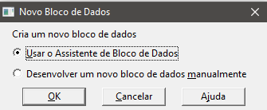 Se você optar por clicar em *ok* na opção **Usar o Assistente de bloco de dados**, você pode criar um bloco de dados com ou sem o seu respectivo canvas,ao passo que a  se você marcar a opção abaixo, você pode criar um bloco em branco.

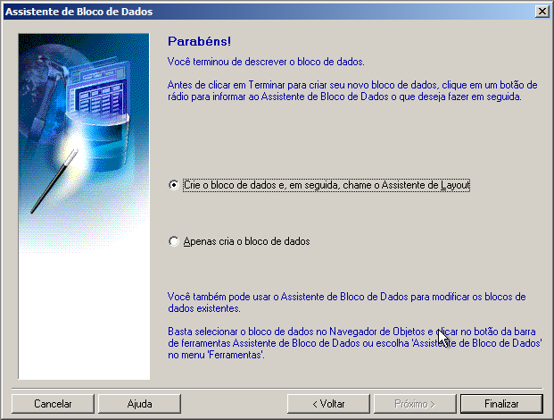 Aqui se você selecionar a opção **Crie o bloco de dados e, em seguida, chame o Assistente de Layout**, abre-se o assistente para a criação de um canvas com base nos campos do bloco de dados criado previamente, ao passo que a opção **Apenas cria o bloco de dados** apenas segue o wizard sem criar o canvas.

### Para concluir
***Duas coisas devem ficar claro, o bloco se for associado ao banco de dados, o mesmo deve ser associado a alguma tabela do banco de dados e os seus ítens devem ser associados aos campos, caso o elemento deva ter contato com algum campo. Além disso qualquer coisa visível ao usuário deve estar dentro do canvas, do contrário o mesmo será um ítem oculto. Por fim é possível incluir triggers, sendo o mesmo estruturado com base em uma `procedure` do PL/SQL.***

### Opções para os Blocos
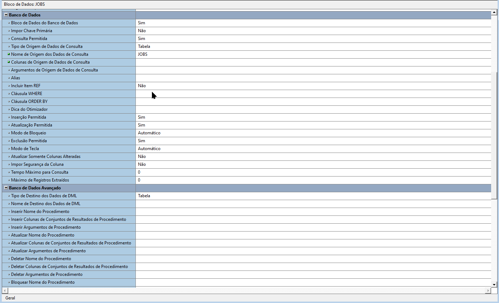

Repare que o em **Nome de origem dos Dados de Consulta** é uma tabela do banco de dados *Oracle*, além disso você pode incluir *Clásulas*, como where or order by, em outras palavras, o *Oracle Form Builder* permite criar um bloco de dados com base em uma tabela. Também é possível criar um bloco com base em uma *procedure* ou *view*. **Segue abaixo um exemplo:**

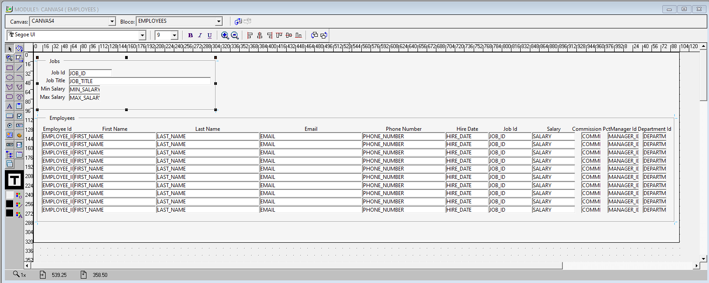

Todos os campos estão relacionados a algum campo na tabela, porém caso algum não esteja, isso deve ser explicitado, sob o risco de dar problema e sequer o canvas carregar para o usuário quando a aplicação rodar. **Para Isso:**

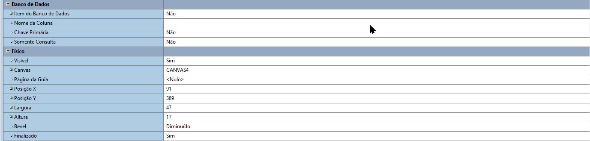
#### Item do Banco de dados
***O campo `Item do Banco de Dados` deve ser compatível com a relidade, se caso algum elemento for de fato referência de um elemento no banco de dados, esse campo deve estar marcado em sim e o campo `Nome de Coluna` deve estar preenchido com o nome do campo correspondente. E se não for esse campo deve estar marcado em não, pois do contrário o Oracle irá procurar por esse campo no banco de dados e isso acarretará em um erro e fará com que não seja renderizado a tela ao usuário.***

#### Físico
Aqui é definido como o campo deve ser exibido no *canvas*, no caso, qual será a posição, tamanho e etc...

### Formulas
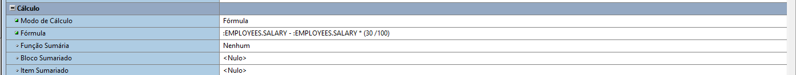

Nesse exemplo temos componente que executa uma formula, para isso esse componente não pode ser um `ítem de banco de dados`. Essa funcionalidade serve caso você queira criar um campo, que pega um dado de banco de dados e executa alguma formula encima dela.

### Resumo

Nesse caso, você marca a opção **Resumo** e preencha os campos `Função sumária` com uma função disponível ali, `Bloco sumarizado` com o nome da tabela e o `item Sumariado` é o campo ao qual será usado, no caso será usado como parametro para a função **Contagem** o campo **EMPLOYEE_ID**. ***Porém para que resumo funcione a opção `Consultar todos os registros` conforme ilustrado abaixo, no bloco, ao qual esse componente está inserido e deve estar marcado como `SIM`, do contrário essa função de resumo pode não funcionar, uma vez que essa opção faz com que o bloco execute a query de uma maneira que a função associada a esse resumo possa ser executado.***

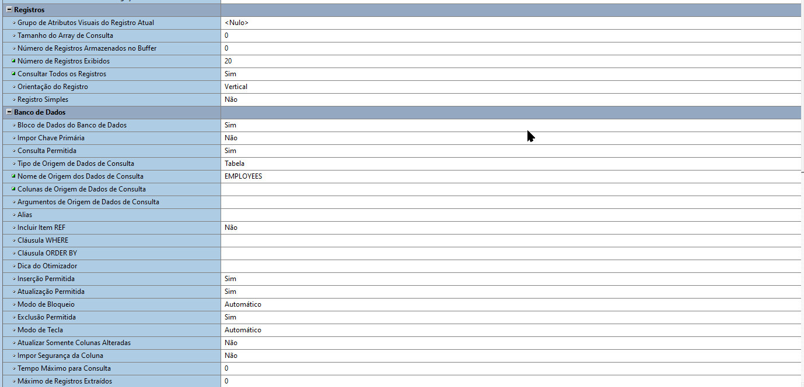

### Relacionamentos

**Você pode montar relacionamentos, ou criando um bloco de dados automaticamente, ou então criando um relacionamento, cuja as propriedades estão ilustradas abaixo:**

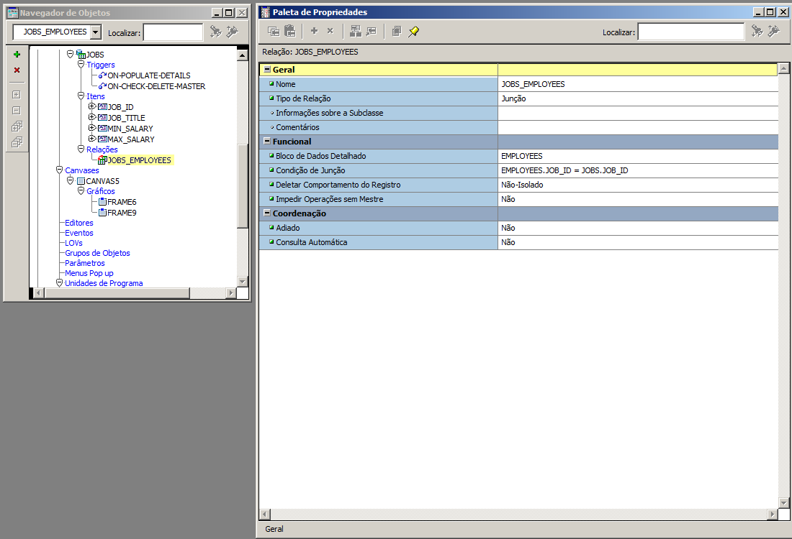

### Trigger

É possível adicionar um código **PL/SQL** dentro de uma **trigger**, no caso o mesmo está estruturado seguindo a mesma lógica que em bloco de procedimento qualquer, ou seja, comandos de projeção deve estar dentro de um variável e por ai vai...

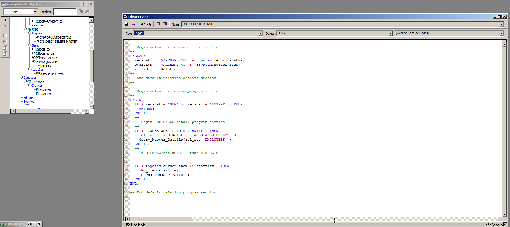

Além disso segue uma lista de eventos, ao qual podem ter códigos **PL/SQL** associado:

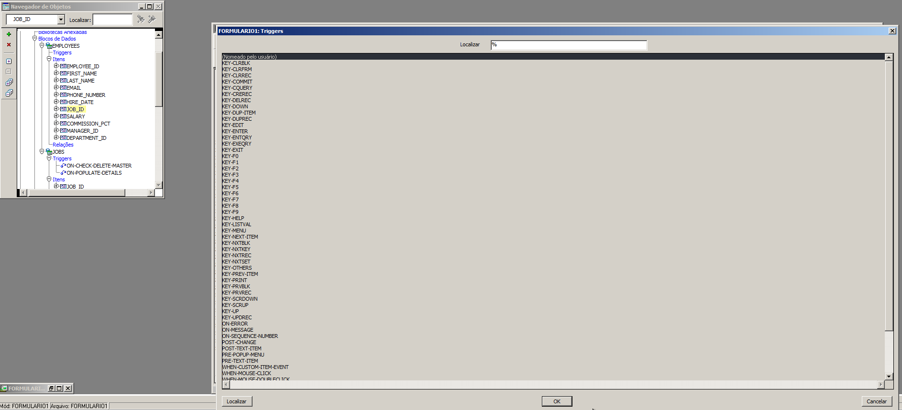

### Variáveis
**No caso, quando você for trabalhar com o `Oracle Forms`, você pode usar a notação ponto para referênciar um elemento dentro de um elemento, no caso a variável para o componente é definido nas propriedades, conforme visto abaixo, que é definido para todo o bloco:**

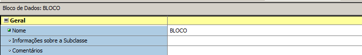

**Assim como acima você também pode definir nome para cada elemento dentro do bloco, ao qual pode ser analizado abaixo, um elemento que pertence ao bloco acima:**

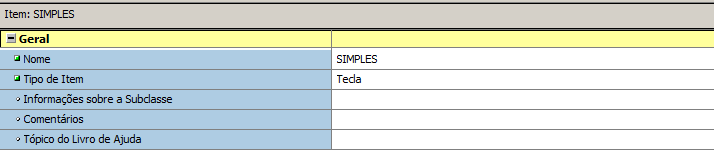

Porém é valido ressaltar que, se você quiser referênciar o bloco nesse exemplo você pode usar `:bloco` ou seja os dois pontos mais o nome atribuído a variável, e se você quiser se referir a um elemento interno você pode usar a anotação ponto, sendo `:bloco.simples` ou se estiver dentro do mesmo escopo `:simples`, mas sempre recomenda-se usar anotação ponto `:bloco.simples`, afim de evitar ambiguidades e maiores problemas. Abaixo, um outro exemplo usando a anotação ponto dentro de uma *trigger*. Nesse exemplo abaixo `:bloco` faz referência ao bloco, `:bloco.resultado` ao componente **resultado**, ao passo que `:bloco.numero` faz referência ao elemento número. **ALEM DISSO NUNCA ESQUEÇA DOS DOIS PONTOS, POIS SE TRATA DE UMA VARIÁVEIL EXTERNA, EXCETO QUE VOCÊ CRIA DENTRO DO ESCOPO, BEGIN E END DA PROCEDURE, VOCÊ DEVE SEMPRE USAR OS `:` PARA REFERENCIAR VARIÁVEIS EXTERNAS, POR ISSO A NECESSIDADE DOS DOIS PONTOS.**

#### Usando notação ponto
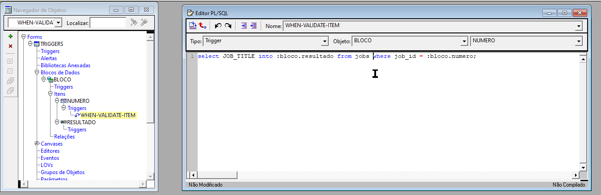

#### Sem notação ponto

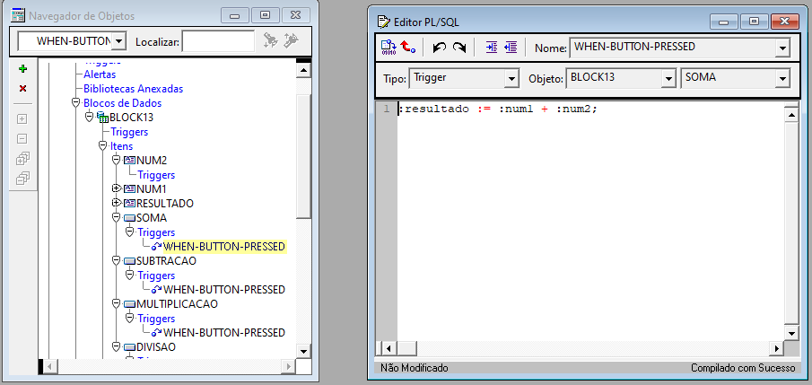

### Alertas Básico
Através do item *alertas* dentro do módulo, ali você organiza todas as suas janelas modais, o mesmo tem uma propriedade que pode ser definida no categoria funcional nas propriedades dela. No caso para chamar-las você deve fazer através de um evento, como por exemplo:

    DECLARE
	    valor_simples number;
    BEGIN
	    valor_simples := show_alert('modal_simples');	
    END;

Você usa a função `show_alert` para isso e passa como argumento em formato de *string* o nome da modal que se encontra na parte de alertas dentro do módulo, nesse exemplo o nome é *modal_simples*. Além disso como esse comando projeta algo na tela, o valor deve obrigatóriamente ser armazenda em uma variável numérica, conforme o ilustrado e com base nesse resultado que você fará a sua lógica.

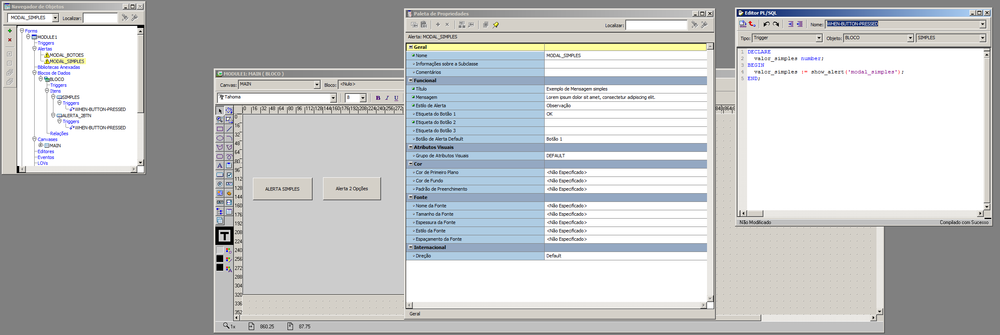

### Alertas com Opções

Aqui temos um exemplo mais complexo, aonde o valor do botão é armazenado e comparado para ver botão o usuário pressionou.

    DECLARE
        alerta_3btn number;
    BEGIN
        alerta_3btn := show_alert('modal_botoes');
        if alerta_3btn = alert_button1 then
            message('OPCAO 1 SELECIONADA');
        elsif alerta_3btn = alert_button2 then
            message('OPCAO 2 SELECIONADA');
        else
            message('OPCAO 3 SELECIONADA');
        end if;
    END;

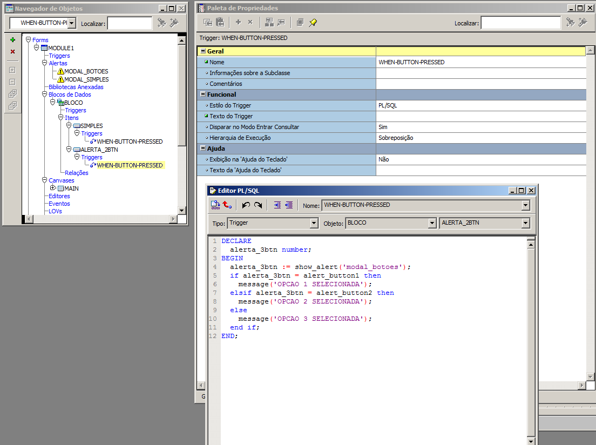
#### alert_button
Caso pressionado o primeiro botão esse valor é ativado `alert_button1`, caso o segundo `alert_button2`, terceiro `alert_button3`.

#### message

Exibe a mensagem no canto da aplicação demonstrado abaixo:

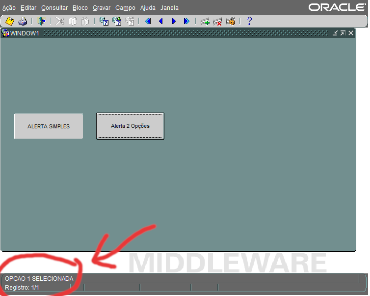

### LOV - List Of Values

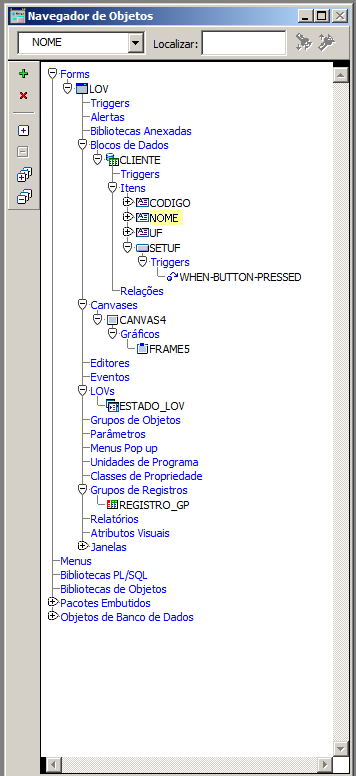

###### Tabela cliente de exemplo
    CREATE TABLE CLIENTE(CODIGO INT PRIMARY KEY,NOME VARCHAR(100) NOT NULL, UF CHAR(2));

#### Explicando
Os *Lovs* seriam uma abreviação de `list of values` e os mesmos trabalham em conjunto com os registros, no caso os `Lovs` estão agrupados no grupo de mesmo nome e os registros estão em **Grupos de registros**, conforme ilustrado acima. Os registros faz a comunicação com os dados, podendo ser estáticos e pré-definidos ou dinâmicos e consequêntemente oriunda do banco de dados, ao passo que os LOVS faz é o componente em si, que estará acessível para intereção com o usuário, caso o menu padrão esteja habilitado, indo em editar e exibir lista, caso o componente esteja selecionado, porém apenas componentes *LOV* devidamente registrados, deverão exibir alguma lista e isso você pode perceber analisando a imagem abaixo:

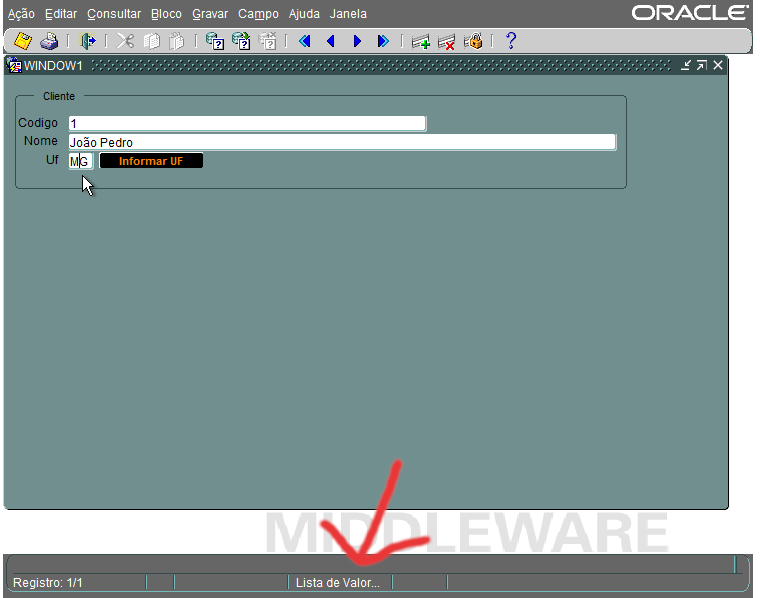

Ou seja uma lista de valor tem algo como **lista de valor** escrito no rodapé, conforme descrito acima e uma vez que esse componente esteja selecionado...

###### Exibindo lista do lov
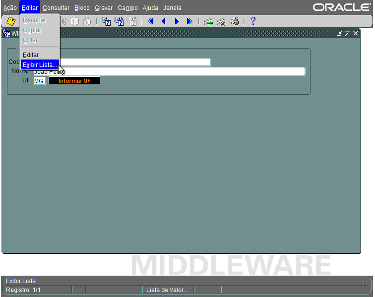

**E então, uma vez selecionado o elemento e a lista temos:**
###### Exibindo LOV Final e funcionando
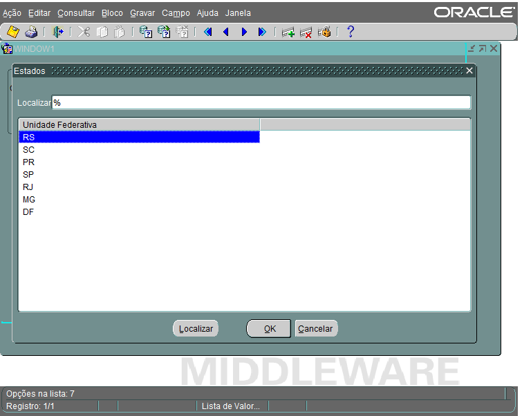

Sendo curto e grosso: o conteúdo da lista é feito pelo registro e o componente, é responsabilidade do *LOV*. Ou seja se precisar editar, usa-se o registro e se quiser editar o componente, procure no *LOV*.

#### Registro Estático

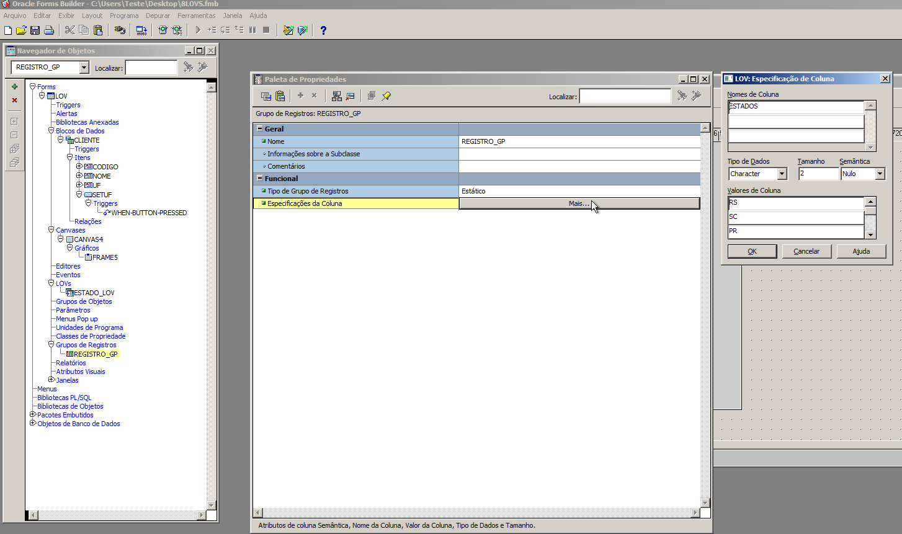

**Da esquerda para a direita a sequência da imagem!**. Ao selecionar um registro do grupo e ir a sua propriedade, algumas opções podem ser configuradas. Primeiro é o nome, como ele será identificado, e após isso no funcional temos o tipo se é estático, ou se é dinâmico através do campo **tipo de grupo de dados** e por fim a especificação de colunas, que como nesse caso é estático, abre a especificação da coluna, ao qual você deve definir o nome da coluna, abaixo, o tipo de dados, e o tamanho, lembrando que esse valor, deve bater com o campo na tabela, caso o mesmo seja usada para preencher um campo do tipo *enum*, que no caso é a principal utilidade disso, preencher de maneira prática um campo com dados pré-definidos e por fim em valores de coluna, você deve informar as opções que o usuário pode escolher.

#### Configurando no LOV

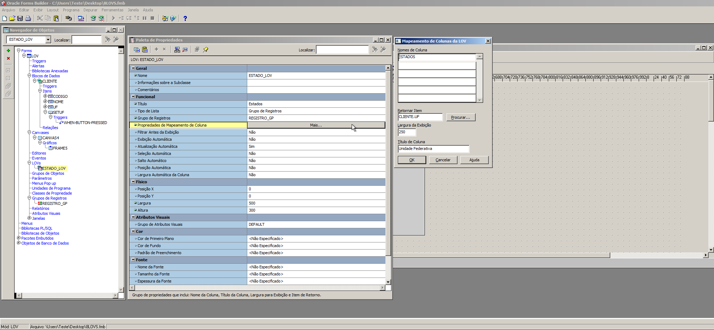

**Indo novamente da esquerda para a direita na imagem.** Ao selecionar um *LOV*, e indo nas propriedades, temos três campos que devem ser observados, o primeiro é o nome, que é como o componente deve ser enxergado na lista, depois o *título*, que é  a barra de *título* que deve aparecer na janela que contém a lista de ítens ao qual o usuário deve interagir, depois em `grupo de registros`, você deve informar, qual registro que será usado, ou seja é aqui que você deve relacionar o registro com o *LOV* e por fim em `Propriedades de Mapeamento de Coluna`, será informado ao *LOV*, como o mesmo deve proceder com o registro, no caso qualquer má configuração aqui ou a ausência de, influência no funcionamento, ou na falta de funcionamento do componente. Ao abrir o modal, aonde está `nomes de coluna`, você deve informar todas as colunas do registro, e sim, pode ter mais de uma e isso você define no registro. No `retornar Item`, você o ítem do bloco de dados, ao qual está relacionada, ou seja é nesse campo que você informa aonde o *LOV* deve jogar o valor pego, ou seja aqui você informa o componente relacionado ao ítem. Nesse exemplo a tabela é `Cliente` e o campo que deve receber o valor dessa *LOV* é o campo `UF`, por isso `Cliente.UF`, que é uma notação ponto entre tabela e coluna. Por fim a largura em pixels que terá essa coluna, e por fim o nome da coluna que será exibido ao usuário e como resultado final você terá [isso. Compare o que foi definido aqui com essa imagem, clicando aqui para entender melhor.](#exibindo-lov-final-e-funcionando).

#### Associando o LOV a um ítem

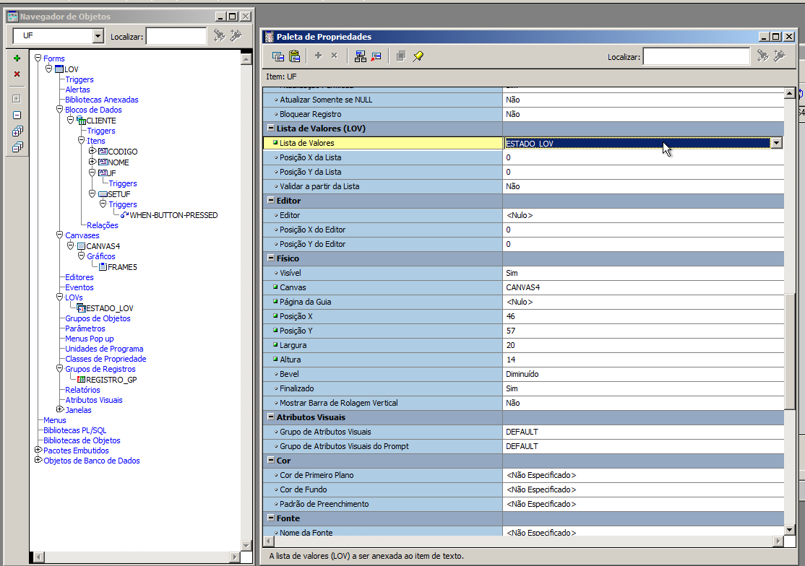

Uma vez que o lov esteja configurado, você deve associar-lo a um ítem, esse ítem vai receber o valor do *LOV* e passa-lo para o banco de dados. No caso esse ítem pode ou não corresponder a um ítem no banco de dados, ele seria como se fosse o *select* do HTML e ele irá disparar o *lov* que permitirá o usuário alterar o seu valor através de uma lista de opções, para associar-lo a um *lov*, na categoria `Lista de valores`, dentro de `Lista de Valores LOV`, selecione o LOV relacionado a esse componente e pronto, tudo funcionará.
### Chamando o ítem Lov ao clicar no botão

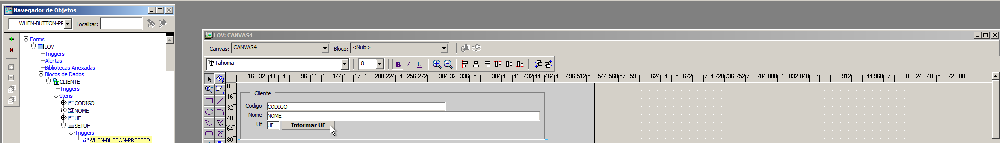

Abaixo a trigger definida a esse botão, quando clicado:

    go_item('uf');
    list_values;

### go_item
O `go_item` é uma função que seleciona um ítem, como se o usuário tivesse clicado nele, ele seria uma espécie de método *focus* se fossemos comparar com um elemento *DOM*, ou seja, ele foca em um ítem, nesse exemplo acima, no ítem de *UF*, que está relacionado com essa *LOV* do exemplo. Resumindo, essa função recebe um argumento e o argumento deve ser o ítem relacionado com a *lov* que você deseja selecionar.

### list_values;
Esse procedimento basicamente chama a lista, se o componente for um componente com lista de valor, deve-se exibir a *lov* associado a ele, como [visto aqui](#exibindo-lista-do-lov). Na prática trata-se de uma macro para executar a lista de lov associado ao ítem selecionado, caso o ítem seja um ítem relacionado a uma lista lov, essa é a forma de exibir o menu de opções sem que o usuário precise clicar em `Editar > Exibir lista`, essa procedure faz o equivalente a essa ação com o ítem selecionado.

### Grupos de registros dinâmicos

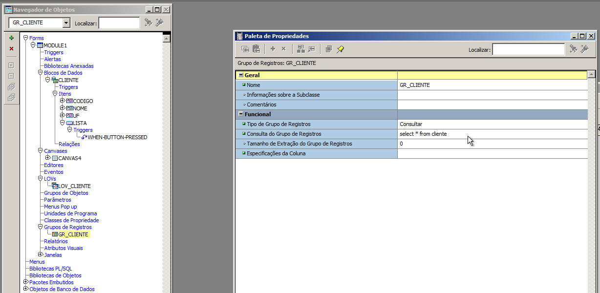

Você pode também definir que os registros sejam carregados de maneira dinâmica e isso ocorre com base em um comando **select**, nesse caso todas as colunas estão sendo pegas, logo a configuração do **LOV** deve ser compatível com isso.

### Configurando o LOV para registros com N colunas

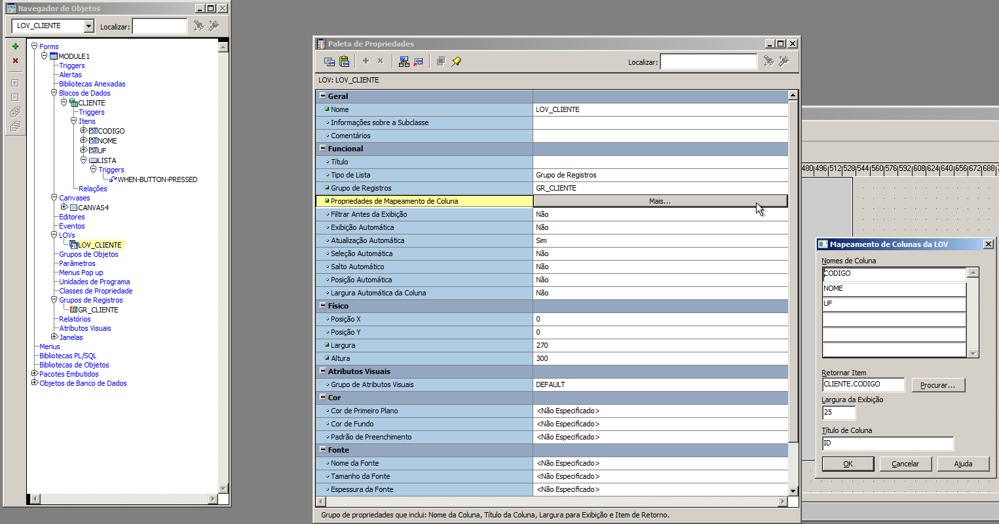

No caso desse mapeamento, você deve informar o nome de cada coluna e o alvo dela.
## Exemplos
##### 1Basico
Aqui tem um exemplo de calculadora básica que executa as quatro operações principais, com um formulário feito no Oracle forms.

##### 2Canvas
Aqui tem um exemplo básico envolvendo formulário no Oracle forms.

##### 3Formulario
Aqui tem um exemplo de um formulario que se conecta com o banco de dados.

##### 4TRIGGERS
Exemplo com um formulário customizável.

##### 5Mestre_detalhes
Exemplo envolvendo o conceito de mestre detalhes no Oracle forms.

##### 6funcoes_resumos
Exemplos envolvendo *funcoes e resumos* no *Oracle Forms*.

##### 7Alertas
Exemplos envolvendo janelas modais.

##### 8Lovs
Exemplo básico envolvendo uma *LOV* com registros estático.