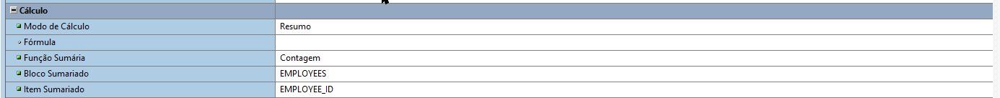

# Oracle Forms
## instalação

### Inicializando o Weblogic
Para que o forms se inicialize o webforms precisa estar rodando, com posse do usuário *weblogic* e da senha configurado na instalação você deve iniciar-lo, o luncher dele deve ser **Iniciar Weblogic Admin Server**. A não inicialização deve dar o erro **FRM-10142**.

### Definindo navegador
Uma vez feito todo o processo de instalação e estiver com o listener do **Oracle Forms** devidamente configurado e se conectando, você irá precisar informar o browser que deseja utilizar, para isso segue os menus abaixo:

    EDITAR > PREFERENCIAS

Uma vez chegado lá, na aba **Runtime** no campo, localização do webBrowser, você deve informar o path do navegador a ser usado, caso você não tenha configurado isso, deve dar o erro `FRM18125`.

### Plugin no navegador
Para que seja exibido o conteúdo do canvas do *Oracle Form* no seu navegador, se faz necessário instalar um plugin chamado **JInitiator**, procure por esse plugin na loja do seu navegador, e instale-o, pois é requisito obrigatório para que seja exibido alguma coisa no navegador. Ele é difícil de encontrar, você pode tentar instalar o **Oracle EBS R12&11i Enablement for Chrome**, ou pesquise por **Oracle EBS** em qualquer navegador que tem um plugin que funciona como trial.

### Permitindo a execução no Navegador
Procure por *configure Java*, uma vez aberto você vai para a guia segurança, na guia segurança existe um campo aonde tem a Lista de exceções de sites, ali você coloca a url ao qual o Oracle forms vai executar, você deve autorizar a **URL DO SERVIDOR DE APLICAÇÕES** ali.

#### Descobrindo a URL DO SERVIDOR DE APLICAÇÕES
Com o oracle forms aberto vai em:

    EDITAR > PREFERENCIAS

ma vez chegado lá, na aba **Runtime** no campo *URL DO SERVIDOR DE APLICAÇÕES* copia a *url* ali e [adicione na permissão na configuração do JAVA](#permitindo-a-execução-no-navegador).

## Explicando
### Básico

#### Bloco de dados
Essa parte se refere ou aos dados que devem ser processados, ou a(s) tabela(s) que tem ligação com o banco de dados, como no exemplo da imagem, seria a tabela **EMPLOYEES** ou **JOBS**. Dentro desse bloco tem o *triggers* que são *triggers* que podem ser anexados aos campos ou ao bloco, podendo esse ultimo se referir ou não a uma tabela no banco de dados, assim como os *itens* se referem ao campo de tabelas no banco de dados. Na parte de item tem os campos, que pode ou não ser relacionado ao campo de uma tabela no banco de dados, as relações entre os blocos também estão relacionados na parte de relações.
#### Canvas
Dentro de **Canvas** tem o sub-ítem de gráficos, ao qual todo o elemento deve estar ali dentro, caso queira que o mesmo seja exibido na aplicação, tudo que estiver dentro do canvas e do frame, será exibido ao usuário, já os campos e item que não estiverem ali, estarão ocultos.

### Criando um novo Bloco com base no banco de dados
 Se você optar por clicar em *ok* na opção **Usar o Assistente de bloco de dados**, você pode criar um bloco de dados com ou sem o seu respectivo canvas,ao passo que a  se você marcar a opção abaixo, você pode criar um bloco em branco.

 Aqui se você selecionar a opção **Crie o bloco de dados e, em seguida, chame o Assistente de Layout**, abre-se o assistente para a criação de um canvas com base nos campos do bloco de dados criado previamente, ao passo que a opção **Apenas cria o bloco de dados** apenas segue o wizard sem criar o canvas.

### Para concluir
***Duas coisas devem ficar claro, o bloco se for associado ao banco de dados, o mesmo deve ser associado a alguma tabela do banco de dados e os seus ítens devem ser associados aos campos, caso o elemento deva ter contato com algum campo. Além disso qualquer coisa visível ao usuário deve estar dentro do canvas, do contrário o mesmo será um ítem oculto. Por fim é possível incluir triggers, sendo o mesmo estruturado com base em uma `procedure` do PL/SQL.***

### Opções para os Blocos

Repare que o em **Nome de origem dos Dados de Consulta** é uma tabela do banco de dados *Oracle*, além disso você pode incluir *Clásulas*, como where or order by, em outras palavras, o *Oracle Form Builder* permite criar um bloco de dados com base em uma tabela. Também é possível criar um bloco com base em uma *procedure* ou *view*. **Segue abaixo um exemplo:**

Todos os campos estão relacionados a algum campo na tabela, porém caso algum não esteja, isso deve ser explicitado, sob o risco de dar problema e sequer o canvas carregar para o usuário quando a aplicação rodar. **Para Isso:**

#### Item do Banco de dados
***O campo `Item do Banco de Dados` deve ser compatível com a relidade, se caso algum elemento for de fato referência de um elemento no banco de dados, esse campo deve estar marcado em sim e o campo `Nome de Coluna` deve estar preenchido com o nome do campo correspondente. E se não for esse campo deve estar marcado em não, pois do contrário o Oracle irá procurar por esse campo no banco de dados e isso acarretará em um erro e fará com que não seja renderizado a tela ao usuário.***

#### Físico
Aqui é definido como o campo deve ser exibido no *canvas*, no caso, qual será a posição, tamanho e etc...

### Formulas

Nesse exemplo temos componente que executa uma formula, para isso esse componente não pode ser um `ítem de banco de dados`. Essa funcionalidade serve caso você queira criar um campo, que pega um dado de banco de dados e executa alguma formula encima dela.

### Resumo

Nesse caso, você marca a opção **Resumo** e preencha os campos `Função sumária` com uma função disponível ali, `Bloco sumarizado` com o nome da tabela e o `item Sumariado` é o campo ao qual será usado, no caso será usado como parametro para a função **Contagem** o campo **EMPLOYEE_ID**. ***Porém para que resumo funcione a opção `Consultar todos os registros` conforme ilustrado abaixo, no bloco, ao qual esse componente está inserido e deve estar marcado como `SIM`, do contrário essa função de resumo pode não funcionar, uma vez que essa opção faz com que o bloco execute a query de uma maneira que a função associada a esse resumo possa ser executado.***

### Relacionamentos

**Você pode montar relacionamentos, ou criando um bloco de dados automaticamente, ou então criando um relacionamento, cuja as propriedades estão ilustradas abaixo:**

### Trigger

É possível adicionar um código **PL/SQL** dentro de uma **trigger**, no caso o mesmo está estruturado seguindo a mesma lógica que em bloco de procedimento qualquer, ou seja, comandos de projeção deve estar dentro de um variável e por ai vai...

Além disso segue uma lista de eventos, ao qual podem ter códigos **PL/SQL** associado:

### Variáveis
**No caso, quando você for trabalhar com o `Oracle Forms`, você pode usar a notação ponto para referênciar um elemento dentro de um elemento, no caso a variável para o componente é definido nas propriedades, conforme visto abaixo, que é definido para todo o bloco:**

**Assim como acima você também pode definir nome para cada elemento dentro do bloco, ao qual pode ser analizado abaixo, um elemento que pertence ao bloco acima:**

Porém é valido ressaltar que, se você quiser referênciar o bloco nesse exemplo você pode usar `:bloco` ou seja os dois pontos mais o nome atribuído a variável, e se você quiser se referir a um elemento interno você pode usar a anotação ponto, sendo `:bloco.simples` ou se estiver dentro do mesmo escopo `:simples`, mas sempre recomenda-se usar anotação ponto `:bloco.simples`, afim de evitar ambiguidades e maiores problemas. Abaixo, um outro exemplo usando a anotação ponto dentro de uma *trigger*. Nesse exemplo abaixo `:bloco` faz referência ao bloco, `:bloco.resultado` ao componente **resultado**, ao passo que `:bloco.numero` faz referência ao elemento número. **ALEM DISSO NUNCA ESQUEÇA DOS DOIS PONTOS, POIS SE TRATA DE UMA VARIÁVEIL EXTERNA, EXCETO QUE VOCÊ CRIA DENTRO DO ESCOPO, BEGIN E END DA PROCEDURE, VOCÊ DEVE SEMPRE USAR OS `:` PARA REFERENCIAR VARIÁVEIS EXTERNAS, POR ISSO A NECESSIDADE DOS DOIS PONTOS.**

#### Usando notação ponto

#### Sem notação ponto

## Exemplos
### 1Basico
Aqui tem um exemplo de calculadora básica que executa as quatro operações principais, com um formulário feito no Oracle forms.

### 2Canvas
Aqui tem um exemplo básico envolvendo formulário no Oracle forms.

### 3Formulario
Aqui tem um exemplo de um formulario que se conecta com o banco de dados.

### 4TRIGGERS
Exemplo com um formulário customizável.

### 5Mestre_detalhes
Exemplo envolvendo o conceito de mestre detalhes no Oracle forms.