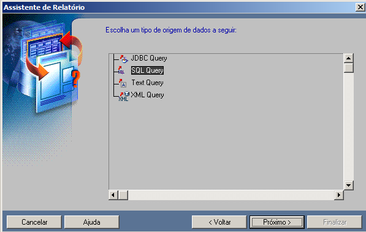

# Oracle Report

## Assistente de Inicio

Através desse assistente acima, é possível criar um relatório de maneira automática usando a opção `Usar o Assistente de Relatório`, também é possível abrir em **modo tutorial** usando a opção `conceitos básicos`, ou abrir ou até mesmo criar tudo manualmente.

### Assistente - Definição Básica

    

             
        
Você pode criar um relatório destinado para WEB ou para impressão, ou até mesmo para os dois.

    

    

    

            
        
Aqui você seleciona o layout do seu relatório, a primeira opção é tabulada, ao passo que a segunda e a terceira se assemelham a formulário, porem destingue entre si pela    posição título, esses três tipos de layout são os mais usuais, sendo o segundo e terceiro focado em <b>Mestre Detalhe</b>.

    

    

    

        
        
Aqui você seleciona a origem dos dados, no caso estamos pegando do banco de dados, logo a opção <b>SQL Query</b> é mais aplicável.
        
    

### Com base no SQL Query

    

             
        
 No caso, aqui você pode informar a query, ou usar a ferramenta <b>Query Builder</b>, clicando no botão de mesmo nome.

    

    

    

            
        
Aqui você define, quais campos você gostaria de incluir.

    

    

    

        
        
E aqui você pode aplicar funções em determinados campos, essa parte é interessante caso precisa somar ou fazer algo asism com um campo.
        
    

### Definindo o visual

    

             
        
Aqui você define a label dos campos, por exemplo, se você não quiser que os nomes originais dos campos sejam exibidos, você pode modificar aqui, muitos campos contem underscore ou hifem e aqui você pode resolver isso.

    

    

    

            
        
Aqui você define o visual da tabela, você também pode carregar algum visual se for o caso.

    
    

